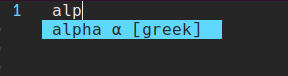

# deoplete-greek
Complete greek letters.

# Install
[dein.vim](https://github.com/Shougo/dein.vim)

```toml
[[plugins]]
repo = 'Inazuma110/deoplete-greek'
depends = ['deoplete.nvim']
```

# screenshot

